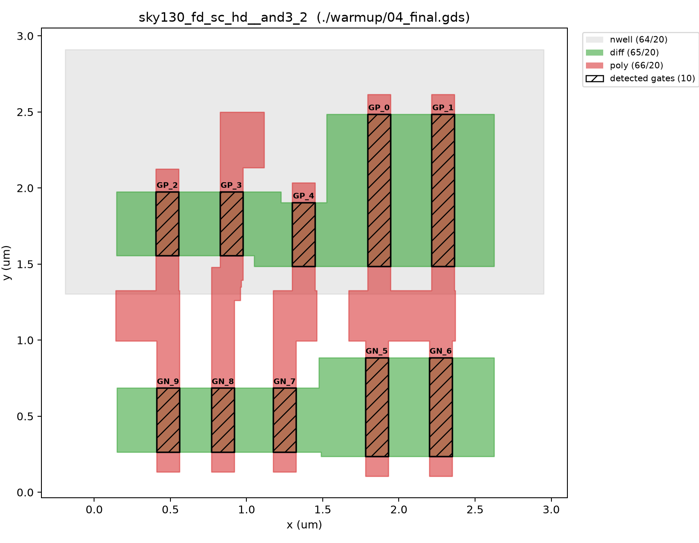

# ASIC Reverse-Engineering Puzzle

This repository provides the files for the Jane Street ASIC reverse-engineering puzzle! See the [blog post](https://blog.janestreet.com/can-you-reverse-engineer-an-asic/) for more details.

## My Solution

I wrote up the full approach — recovering transistors and gates from raw GDS geometry, reconstructing Verilog from the physical layout, and solving for the input that drives `success` high (plus the easter eggs hidden along the way) — in this post:

**[Reverse Engineering an ASIC](https://jlvargasme.github.io/posts/reverse-engineering-an-asic.html)**

See [Project Structure](#project-structure) below for how the code in this repo maps to that write-up, and [Testing / Reproducing the Solution](#testing--reproducing-the-solution) for how to run it yourself.

### Puzzle GDS

The puzzle GDS is in this repository, in the file named `puzzle.gds`. You can preview it using [KLayout](https://www.klayout.de/) or the [TinyTapeout Online GDS Viewer](https://gds-viewer.tinytapeout.com/).

See `example_inputs.vcd` which shows some inputs being fed to the design (unfortunately, not the correct inputs to make `success` go high!). You can view it using [Surfer](https://surfer-project.org/) or a similar tool.

To help you get started, below is an image with some hints. The region labelled as "output generator" is safe to ignore during your initial reverse-engineering steps, but you'll need to simulate it to get your final answer!



### Warm-up Puzzle

To familiarize yourself with the flow and help develop your tools, we've put together a small example design and run it through a very similar flow to the one used for the real thing! The example design consists of two shift registers, an adder, and a comparator, outputting success if `A + B == 496`.

You'll find the following files related to the warm-up puzzle:

- `warmup/00_source.v`: The original Verilog source code of the example design
- `warmup/01_netlist.v`: Synthesized netlist comprising of a list of standard cells
  and connections
- `warmup/02_netlist_with_power_rails.v`: Netlist with VDD and GND rails added
- `warmup/03_post_place_and_route.def`: Physical layout of cells and routing
  connections, corresponding to cell and net names.
- `warmup/04_final.gds`: The final manufacturable layout file, with many internal names
  removed

## Project Structure

**Core pipeline** (repo root) — geometry in, Verilog out:

- `chip.py`, `cell.py`, `transistor.py`, `geometry.py`, `gds_utils.py` — parse a GDS
  file, extract transistors from poly/diff overlap, and classify NMOS vs. PMOS by
  nwell overlap
- `net_trace.py`, `pin.py`, `union_find.py` — build each cell's own electrical
  net graph and classify each pin as input/output purely from geometry (does a net
  terminate on a transistor gate, or on a diffusion node?)
- `clustering.py`, `chip_manipulation.py` — group a chip's cells into clusters that
  correspond to source Verilog modules, and build a Z3 model of the chip's
  combinational logic to solve for inputs
- `decompiler.py` — turns the recovered clusters into an AST and emits actual
  Verilog (`adder_demo.v`, `puzzle.v`)
- `main.py` — runs the whole pipeline end to end on one GDS file
- `pipeline.py`, `plot_utilities.py`, `netlist.py` — orchestration and plotting
  helpers used throughout

**`chip_sim/`** — once `puzzle.gds` is decompiled into clusters, this is a
cycle-accurate Python re-simulation of each individual `cluster_type_N` module
(hand-verified against the decompiled Verilog and cross-checked with truth
tables), used because puzzle.gds's registers make it too large to solve as one
flat Z3 model the way `adder_demo` can be:

- `cluster0.py` … `cluster12.py` — one file per cluster type
- `drive_cluster1.py` — runs the full chip cycle by cycle to read off the
  `success`/`O[0..7]` outputs
- `enumerate_solutions.py` — exhaustively enumerates every input sequence that
  satisfies `success=1` AND produces a readable ASCII message

**`solve_success.py`** / **`solve_success_ascii.py`** (repo root) — the actual
Z3 solve for `puzzle.gds`: the first finds *any* input that drives `success`
high (constraint cardinalities recovered from `chip_sim`'s truth tables), the
second adds cluster1's own register state and a printable-ASCII constraint on
top, since `success=1` alone turns out to be necessary but not sufficient for
a legible message.

**`sim/`** — Verilator testbenches that cross-check the reverse-engineered
Verilog against ground truth: `tb_adder_demo.cpp` + `run_adder_demo.sh` run the
same testbench against both `warmup/00_source.v` (known-correct) and the
decompiled `adder_demo.v`; `tb_puzzle*.cpp` do the equivalent for `puzzle.v`
against the provided `example_inputs.vcd` and the solved witness input.

**`warmup/`** — Jane Street's own calibration design (see above); **`schematics/`**
— generated diagrams and plots referenced from the write-up; **`test_suite.py`**
— regression tests validating cell/gate extraction against known-good cells.

## Testing / Reproducing the Solution

```bash
pip install -r requirements.txt
```

`PySpice` additionally needs [ngspice](https://ngspice.sourceforge.io/) installed
as a system binary (not a pip package) for the SPICE cross-checks to run.

**1. Validate the extraction toolkit** against the warm-up design (transistor/pin
extraction, Z3 gate models, PySpice cross-check, all compared to known-good cells):

```bash
python test_suite.py
```

**2. Run the full pipeline** end to end on a GDS file (clustering, decompiling to
Verilog, and solving for the inputs that drive every output net high):

```bash
python main.py ./warmup/04_final.gds adder_demo   # adder_demo, or:
python main.py puzzle.gds puzzle                  # the real puzzle
```

**3. Solve for the actual puzzle answer** — the 121-bit input that drives
`puzzle.gds`'s `success` output high and decodes to a readable message:

```bash
python solve_success.py         # any success=1 witness
python solve_success_ascii.py   # constrained to a printable-ASCII message -- the real answer
```

`chip_sim/enumerate_solutions.py` goes one step further and exhaustively
enumerates *every* input sequence satisfying both constraints (there turn out
to be exactly 16, all decoding to the same message).

**4. Cross-check against Verilator** (needs `verilator`, `make`, and `g++` on
`PATH`):

```bash
bash sim/run_adder_demo.sh
```

This builds and runs the same testbench against both the known-correct
`warmup/00_source.v` and the reverse-engineered `adder_demo.v`, confirming they
behave identically.
